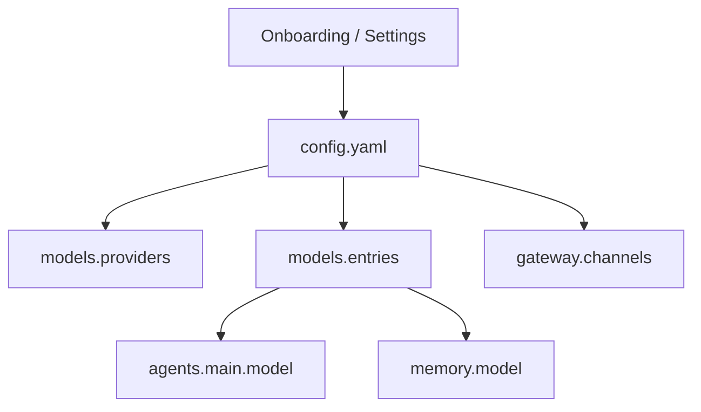

EdgeClaw 的配置入口是 `~/.edgeclaw/config.yaml`。Web 设置页、首次启动向导和 CLI 都围绕这份文件工作。

## 最小模型配置

最小可用配置包含四类信息：

```yaml
models:
  providers:
    edgeclaw:
      type: openai-chat
      baseUrl: https://api.example.com/v1
      apiKey: sk-xxxx
  entries:
    default:
      provider: edgeclaw
      name: your-model-name
agents:
  main:
    model: default
memory:
  enabled: true
```

## 配置流向



## Secret 处理

UI 返回配置时会 mask secret。保存 masked secret 时，后端会保留旧值，避免用户只是改了普通字段却意外清空 API Key。
