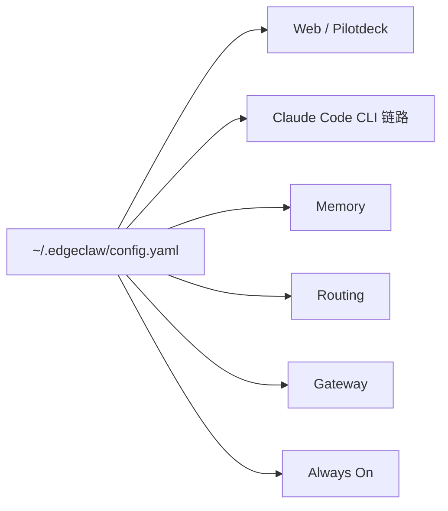

EdgeClaw 的核心思路是用一份配置驱动多套能力：网页版控制台、CLI、Memory、Routing、Gateway 和 Always On。



## 为什么要统一配置

早期本地工具常见的问题是：UI 有一份 `.env`，CLI 有一份 `.env`，Memory 或 Gateway 又各自维护一份配置。时间一长，密钥、模型名、端口和开关就容易不一致。

EdgeClaw 选择把用户配置集中到：

```text
~/.edgeclaw/config.yaml
```

这样模型服务商、模型条目、Agent 使用的模型、Memory 是否启用、Gateway 渠道开关都可以从同一份配置派生。

## 当前文档状态

本教程第一阶段先完善安装与启动路径。架构页面先提供核心关系，后续会补充更详细的数据流、服务边界和扩展方式。
