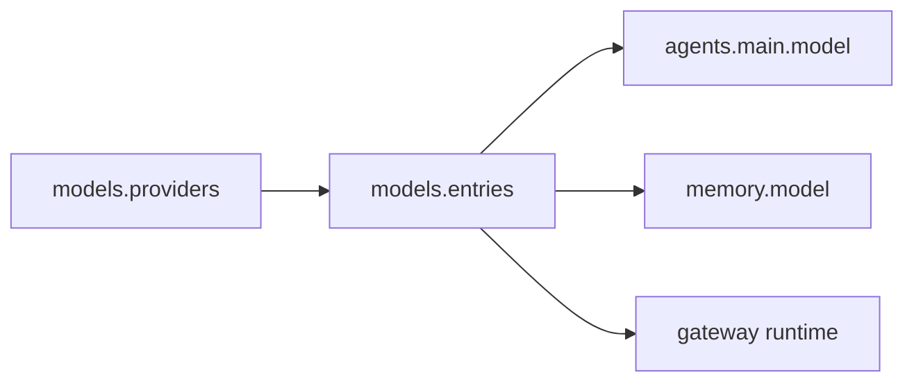

Routing 负责把“服务商配置”和“Agent 实际使用的模型”解耦。

## 基本关系

- `models.providers` 描述服务商的协议、Base URL 和 API Key。
- `models.entries` 描述可被引用的模型条目。
- `agents.main.model` 指向一个模型条目，而不是重复写 API Key。

## 为什么这样设计

这样可以让 Agent、Memory、Routing、Gateway 共享同一套模型定义，避免不同模块重复维护服务商配置。
